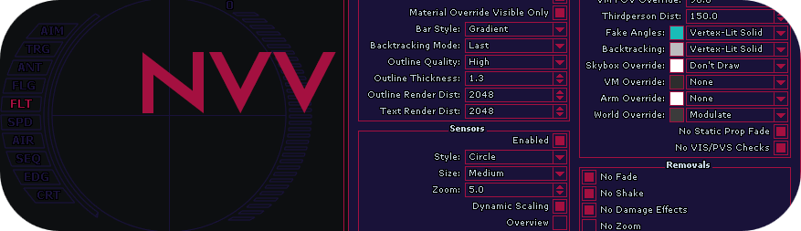

  

<h3 align="center"> Null Core - Visuals Vault Site Source Code </h3>

## Information
This repository was created in order to make easier to create update notes and provide to users a way to **contribute to the site**.

## Contribution
This repository is **highly maintained**. That means every created issue and pull request here will be reviewed and the action will be taken in the **short amount of time**.
### How can I contribute?
- **Pinpointing any bugs or issues**
  - You must provide a bit of information about it or include a screenshot of the issue, if not, the issue will be closed.
- **Creating a pull request including fixes or changes to the code**
- **Creating a suggestion**
  - Please provide as much information as possible about it for the maintainer before creating it in 'Issues' tab.

## Files
Some of the files will not appear in this repository such as **.php** files or some of downloadable content of mods page.

## Contributors
- #### Krawi - For pinpointing issues and providing feedback on updates
- #### Eso - For pinpointing issues